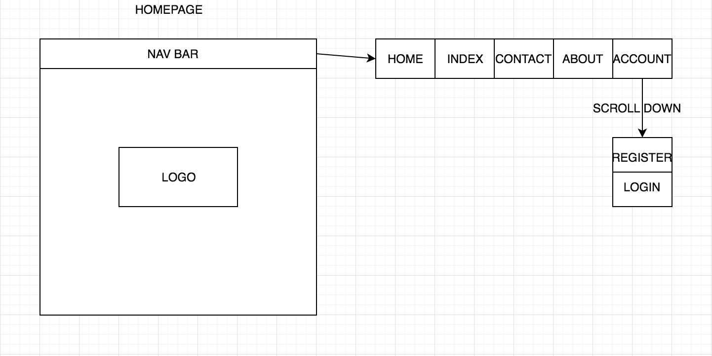
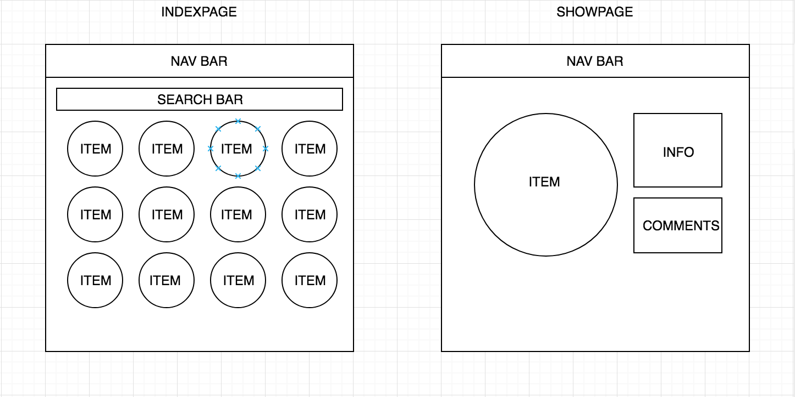
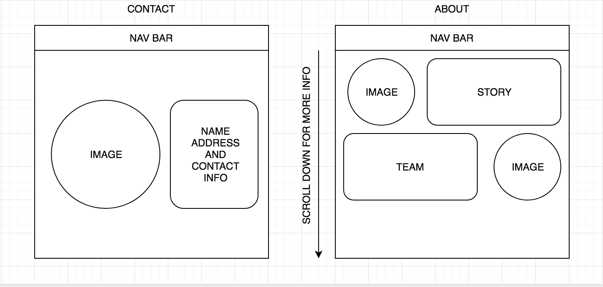
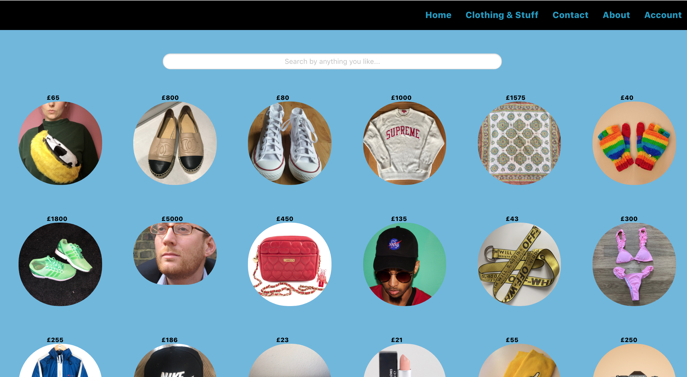
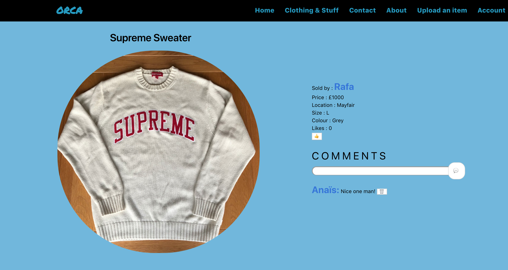
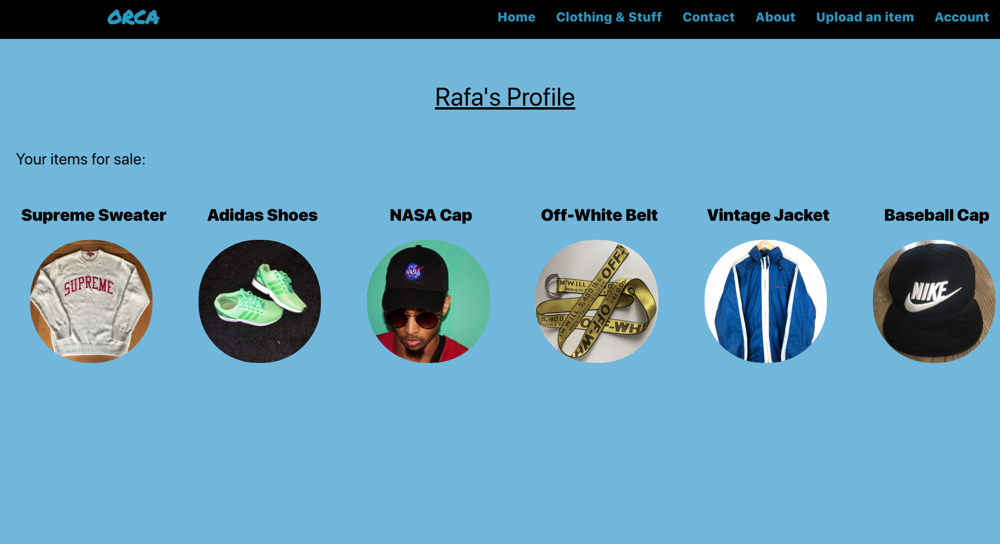

# wdi-project-3

## Brief

The was our first group project, where we had to create a fully RESTful app. With multiply
models and multiply controllers.

## ORCA

Our app was a second-hand buying and sell website, revolved around clothing. With a charity aspect, with every item sold there would be a small donation to Orcas.

## Technologies Used

 HTML || CSS || JavaScript || Angular || BULMA || Trello || draw.io

## Wireframes

## The App

As a user you are able to add new item, comment on existing items and like items. The main page would be the index page where you can view all the items for sale. This also has a search bar which searches my key words.

`

  

    <input id="input" placeholder="Search by anything you like..." type="text" class="input is-rounded" ng-model="$parent.searchBar">
  

`

When a user uploads an item, its add to the array of their items, which is show on the users page. Plus the name of the user, is presented on the item show page, which links to the users page.

This is Rafa's item:

Within the 'Sold By' there is a link to Rafa user page, which looks like this.

Finally, I would like to point out the like button. Within the Show page I have added two buttons, which one invoking the createLikes function when click (ng-click), the other invoking the createUnlikes function. These does a HTTP POST request, which adds a like and then reloads the page.

`$scope.createLikes = function() {
  console.log('liked');
  // Flash.create('info', 'you liked this item');
  $http({
    method: 'POST',
    url: /api/items/${$state.params.id}/like
  }).then(() => $state.reload());
};`

## Challenges

I had a issue with likes, when I had two buttons (👍 and 👎) shown on the show page, as a user you could add as many like as you like, I wanted to have it as each your gets one. To solve this I add a ng-if which would determine if the item has been liked by the user, so if the user liked the item the unlike button would so and vis-vera.

`

  <button ng-if="!liked()" ng-click="createLikes()">👍</button>
  <button ng-if="liked()" ng-click="createUnlikes()">👎</button>

`

 Also when a user click the like button it wouldn't show on the page, until the page was reloaded. So I just added a .then at the end of the HTTP request, that would reload the page when the request is send.

 `.then(() => $state.reload());`

## Future Additions

### Map
If we had time we would add a MapBox, so that when a user is create, they could add their location, then you could shop by location. To do this I would need to add MapBox, also add a new key value pair onto the user model, as I would use Map Box. I would need to have the longitude and latitude on the model.

### Categories
I would have liked to add a category scroll section, instead of having an index page with a long list of items, the user would have the option to search by category. I would do this by adding a scroll down menu in the index page with preselected category name, eg. short, trousers, hats, etc. So when one is selected the items are filtered by their category name, which would is already in the model.
